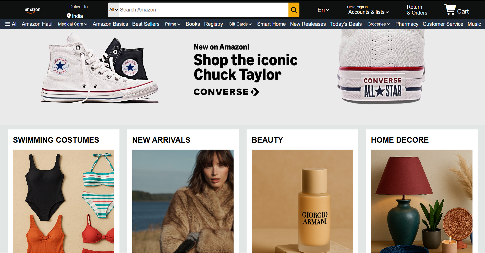

# Amazon Clone

## 📌 Project Overview
A simple Amazon clone built using HTML, CSS, and JavaScript.  
This project replicates the basic UI and functionality of Amazon.

## ✨ Features
- Homepage with product listings  
- Responsive design for mobile and desktop  
- Add to cart functionality  
- Login/Signup page  

## 🚀 How to Run
1. Clone the repository:
   ```bash
   git clone https://github.com/Sahajpreetk/Amazon-Clone.git
## 📷 Screenshots

Note: Optimized for Desktop screens (1920 \times 1080). Mobile responsiveness is under development.
